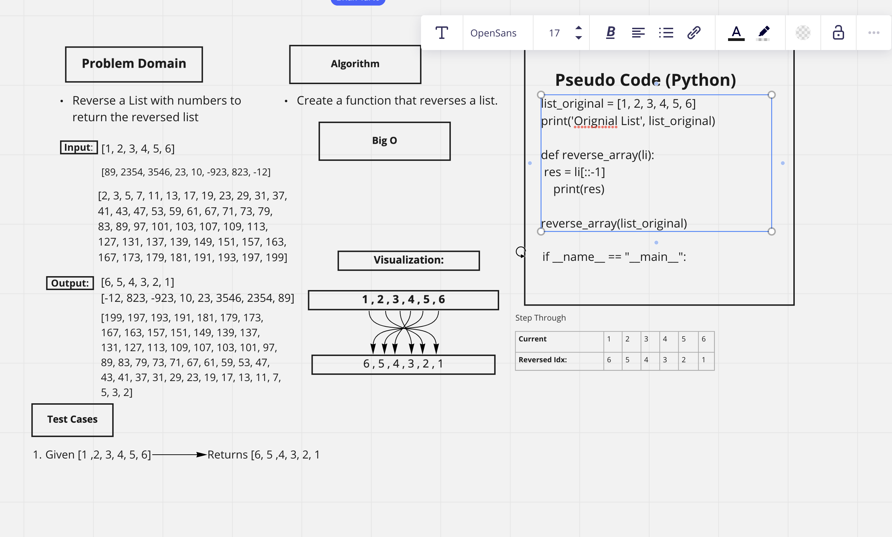

# Reverse an Array

This whiteboard code challenges was completed with Brian and myself, we created a function to reverse a list in Python.

## Whiteboard Process

## Approach & Efficiency
We used Miro for the whiteboard process to create a function and displayed how the information is being used and reversing the the list.
