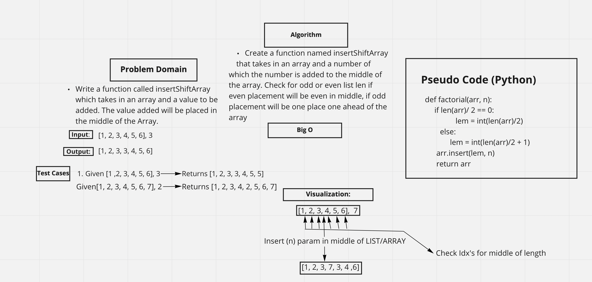

# Insert to Middle of an Array
Create a function in Python that takes in an Array and a Number. Place the number in the middle of the array without using any built in Python methods.

## Whiteboard Process

## Approach & Efficiency
Used a the len() method to check the length of the array and divided it by if even & if not even divided by 2 + 1 to place one ahead since there wont ever be a middle with an even ammount of numbers.
